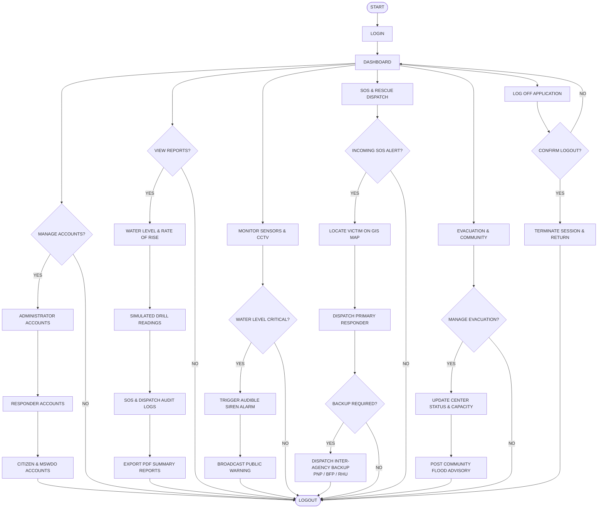

# ADMIN ROLE PROCESS FLOWCHART TUTORIAL & MANUSCRIPT GUIDE
### Flood Monitoring & Disaster Response Management System
*(MDRRMO Central Incident Command Center Web Portal)*

---

## 📌 Document Overview

This tutorial and reference guide provides everything you need to create, draw, and document the **Admin Role Process Flowchart** for your thesis/capstone manuscript.

It is structured in the exact format required by IT/CS thesis standards (matching your reference manuscript format: `START` $\rightarrow$ `LOGIN` $\rightarrow$ `DASHBOARD` $\rightarrow$ horizontal modular branches $\rightarrow$ `LOGOUT/END`).

You can copy and paste any section of this markdown file directly into **Gemini**, **draw.io**, or your **Google Docs / MS Word manuscript**.

---

## 1. Flowchart Specification Table (For Manuscript)

### Figure Title for Manuscript:
> **Figure 39. Proposed Process Flowchart – MDRRMO Administrator (Command Center Web Application)**

### Standard Flowchart Symbols:
| Symbol / Shape | Name | Purpose in this Diagram |
| :---: | :---: | :--- |
| **Oval / Capsule** | **Terminator** | Represents `START` and `LOGOUT` / `END`. |
| **Rectangle** | **Process** | Represents actions, screen navigation, data entry, and sub-modules. |
| **Diamond** | **Decision** | Represents conditional evaluations requiring `YES` or `NO` branches. |
| **Arrow (Line)** | **Flowline** | Directs operational flow and loops between stages. |

---

## 2. Step-by-Step Shape & Content Table

| Step # | Shape | Text to Write Inside Shape | Connects To (Next Step) | Arrow Label / Condition |
| :---: | :---: | :--- | :---: | :---: |
| **1** | **Oval** | `START` | Step 2 | — |
| **2** | **Rectangle** | `LOGIN` | Step 3 | — |
| **3** | **Rectangle** | `DASHBOARD` | Step 4, 8, 13, 17, 23, 27 | *(Main Navigation Hub)* |
| **—** | **—** | **BRANCH 1: MANAGE ACCOUNTS** | **—** | **—** |
| **4** | **Diamond** | `MANAGE ACCOUNTS?` | Step 5 (YES) Step 32 (NO) | `YES` `NO` |
| **5** | **Rectangle** | `ADMINISTRATOR ACCOUNTS` | Step 6 | — |
| **6** | **Rectangle** | `RESPONDER ACCOUNTS` | Step 7 | — |
| **7** | **Rectangle** | `CITIZEN & MSWDO ACCOUNTS` | Step 32 | — |
| **—** | **—** | **BRANCH 2: VIEW REPORTS & ANALYTICS** | **—** | **—** |
| **8** | **Diamond** | `VIEW REPORTS?` | Step 9 (YES) Step 32 (NO) | `YES` `NO` |
| **9** | **Rectangle** | `WATER LEVEL READINGS & RATE OF RISE` | Step 10 | — |
| **10** | **Rectangle** | `DETAILED SIMULATED DRILL READINGS` | Step 11 | — |
| **11** | **Rectangle** | `SOS RESCUE & DISPATCH AUDIT LOGS` | Step 12 | — |
| **12** | **Rectangle** | `EXPORT PDF SUMMARY REPORTS` | Step 32 | — |
| **—** | **—** | **BRANCH 3: MONITOR WATER LEVEL & CCTV** | **—** | **—** |
| **13** | **Rectangle** | `MONITOR SENSORS & CCTV` | Step 14 | — |
| **14** | **Diamond** | `WATER LEVEL CRITICAL?` | Step 15 (YES) Step 32 (NO) | `YES` `NO` |
| **15** | **Rectangle** | `TRIGGER AUDIBLE SIREN ALARM` | Step 16 | — |
| **16** | **Rectangle** | `BROADCAST PUBLIC WARNING` | Step 32 | — |
| **—** | **—** | **BRANCH 4: SOS & RESCUE MANAGEMENT** | **—** | **—** |
| **17** | **Rectangle** | `SOS & RESCUE DISPATCH` | Step 18 | — |
| **18** | **Diamond** | `INCOMING SOS ALERT?` | Step 19 (YES) Step 32 (NO) | `YES` `NO` |
| **19** | **Rectangle** | `LOCATE VICTIM ON GIS MAP` | Step 20 | — |
| **20** | **Rectangle** | `DISPATCH PRIMARY RESPONDER` | Step 21 | — |
| **21** | **Diamond** | `BACKUP REQUIRED?` | Step 22 (YES) Step 32 (NO) | `YES` `NO` |
| **22** | **Rectangle** | `DISPATCH INTER-AGENCY BACKUP (PNP/BFP/RHU)` | Step 32 | — |
| **—** | **—** | **BRANCH 5: EVACUATION & ANNOUNCEMENTS** | **—** | **—** |
| **23** | **Rectangle** | `EVACUATION & COMMUNITY` | Step 24 | — |
| **24** | **Diamond** | `MANAGE EVACUATION?` | Step 25 (YES) Step 32 (NO) | `YES` `NO` |
| **25** | **Rectangle** | `UPDATE EVACUATION CENTER STATUS & CAPACITY` | Step 26 | — |
| **26** | **Rectangle** | `POST COMMUNITY FLOOD ADVISORY` | Step 32 | — |
| **—** | **—** | **BRANCH 6: LOG OFF APPLICATION** | **—** | **—** |
| **27** | **Rectangle** | `LOG OFF APPLICATION` | Step 28 | — |
| **28** | **Diamond** | `CONFIRM LOGOUT?` | Step 29 (YES) Step 3 (NO) | `YES` `NO` |
| **29** | **Rectangle** | `TERMINATE SESSION & RETURN TO LOGIN` | Step 30 | — |
| **30** | **Oval** | `LOGOUT` | — | *(Terminal End)* |
| **32** | *(Bus)* | *[Convergence Line to Logout]* | Step 30 | — |

---

## 3. Mermaid Diagram Code (Copy-Paste to Mermaid / Markdown / Gemini)

---

## 4. Step-by-Step Guide to Draw This in Draw.io

If you are using **draw.io** (as shown in your browser tab `Untitled Diagram - draw.io`), follow these quick steps:

### Step 1: Canvas Settings
1. In draw.io, set **Page View** to ON and **Grid** to ON.
2. Select **Paper Size: Letter** or **A4** in **Portrait** or **Landscape** (Landscape works best for multi-column flowcharts).

### Step 2: Draw the Header Spine (Top)
1. Add an **Oval**: Type `START`.
2. Below it, add a **Rectangle**: Type `LOGIN`. Connect an arrow from `START` down to `LOGIN`.
3. Below `LOGIN`, add a **Rectangle**: Type `DASHBOARD`. Connect `LOGIN` down to `DASHBOARD`.

### Step 3: Draw the 6 Module Columns (Left to Right)
From the bottom edge of `DASHBOARD`, draw an outgoing line that splits into 6 vertical columns:
* **Column 1 (Accounts):** Diamond `MANAGE ACCOUNTS?` $\rightarrow$ Stacked Rectangles for `ADMINISTRATOR ACCOUNTS`, `RESPONDER ACCOUNTS`, `CITIZEN & MSWDO ACCOUNTS`.
* **Column 2 (Reports):** Diamond `VIEW REPORTS?` $\rightarrow$ Stacked Rectangles for `WATER LEVEL & RATE OF RISE`, `SIMULATED DRILL READINGS`, `SOS AUDIT LOGS`, `EXPORT PDF`.
* **Column 3 (Sensors):** Rectangle `MONITOR SENSORS & CCTV` $\rightarrow$ Diamond `WATER LEVEL CRITICAL?` $\rightarrow$ Rectangles for `TRIGGER AUDIBLE SIREN` and `BROADCAST PUBLIC WARNING`.
* **Column 4 (Emergency SOS):** Rectangle `SOS & RESCUE DISPATCH` $\rightarrow$ Diamond `INCOMING SOS ALERT?` $\rightarrow$ Rectangles for `LOCATE VICTIM ON GIS MAP`, `DISPATCH PRIMARY RESPONDER` $\rightarrow$ Diamond `BACKUP REQUIRED?` $\rightarrow$ Rectangle `DISPATCH INTER-AGENCY BACKUP`.
* **Column 5 (Evacuation):** Rectangle `EVACUATION & COMMUNITY` $\rightarrow$ Diamond `MANAGE EVACUATION?` $\rightarrow$ Rectangles for `UPDATE CENTER STATUS & CAPACITY` and `POST COMMUNITY ADVISORY`.
* **Column 6 (Log Off):** Rectangle `LOG OFF APPLICATION` $\rightarrow$ Diamond `CONFIRM LOGOUT?` $\rightarrow$ Rectangle `TERMINATE SESSION`.

### Step 4: Draw the Bottom Convergence Line (Spine)
1. Place a single **Oval** at the bottom center: Type `LOGOUT`.
2. Connect all outgoing bottom paths from Columns 1 to 6 into a horizontal bus line that points into `LOGOUT`.
3. If `CONFIRM LOGOUT?` is `NO`, loop the arrow back up to `DASHBOARD`.

---

## 5. Thesis / Manuscript Narrative Description (Copy to Chapter 3 / 4)

Below is the formal manuscript writeup to accompany your flowchart figure:

> ### **Figure 39: Admin Role Process Flowchart**
> 
> **Narrative Description:**
> 
> Figure 39 illustrates the operational workflow of the MDRRMO Administrator within the web-based command center portal. The process commences at the **START** state, requiring the authorized officer to authenticate via the **LOGIN** module. Upon successful cryptographic verification of administrator credentials, the system redirects the user to the central **DASHBOARD**.
> 
> From the dashboard, the administrator can navigate across six core functional modules:
> 
> 1. **User Account Management:** Enables the administrator to audit, create, modify, and deactivate accounts categorized into system administrators, emergency field responders, municipal social welfare officers (MSWDO), and registered community citizens.
> 2. **Reports & Analytical Audits:** Provides full access to historical hydrological time-series data, rate-of-rise calculations, simulated drill performance records, and SOS dispatch response audit trails, with functionality to export official PDF incident reports.
> 3. **Sensor & Flood Monitoring:** Facilitates real-time visual surveillance via on-site CCTV video feeds and computerized water gauge readings. If the river elevation crosses predetermined critical warning thresholds, the administrator can manually or automatically engage audible siren alerts and broadcast synchronized SMS/push warnings.
> 4. **Emergency SOS & Mission Dispatch:** Provides real-time geospatial tracking of citizen distress calls. The administrator locates victims on the GIS map, designates the nearest active rescue team, and initiates multi-agency backup protocols (PNP, BFP, RHU) when incident severity warrants escalation.
> 5. **Evacuation & Community Advisories:** Coordinates shelter management by dynamically updating evacuation center occupancy thresholds, relief availability, and publishing official municipal weather bulletins.
> 6. **System Log Off:** Concludes the active command session, revoking session tokens and securely returning the portal interface to the authentication screen prior to reaching the **LOGOUT** terminator state.

---

## 6. Code Mapping (How this maps to your actual source code)

| Flowchart Node | Frontend Source Code File | Backend Endpoint / Logic |
| :--- | :--- | :--- |
| `LOGIN` | [`Login.jsx`](file:///c:/Users/jayze/Documents/GitHub/Flood_Monitoring/flood_monitor/frontend/src/pages/Login.jsx) | `POST /api/auth/login` |
| `DASHBOARD` | [`Dashboard.jsx`](file:///c:/Users/jayze/Documents/GitHub/Flood_Monitoring/flood_monitor/frontend/src/pages/Dashboard.jsx) | `GET /api/readings/latest` |
| `MANAGE ACCOUNTS` | [`Users.jsx`](file:///c:/Users/jayze/Documents/GitHub/Flood_Monitoring/flood_monitor/frontend/src/pages/Users.jsx) | `/api/users` (CRUD) |
| `REPORTS & ANALYTICS` | [`Analytics.jsx`](file:///c:/Users/jayze/Documents/GitHub/Flood_Monitoring/flood_monitor/frontend/src/pages/Analytics.jsx) & [`AuditLogs.jsx`](file:///c:/Users/jayze/Documents/GitHub/Flood_Monitoring/flood_monitor/frontend/src/pages/AuditLogs.jsx) | `/api/analytics`, `/api/sos/audit` |
| `MONITOR SENSORS & CCTV` | [`LiveCameraFeed.jsx`](file:///c:/Users/jayze/Documents/GitHub/Flood_Monitoring/flood_monitor/frontend/src/components/dashboard/LiveCameraFeed.jsx) | OpenCV AI stream + HLS |
| `TRIGGER SIREN ALARM` | [`SirenAlert.jsx`](file:///c:/Users/jayze/Documents/GitHub/Flood_Monitoring/flood_monitor/frontend/src/components/dashboard/SirenAlert.jsx) | `POST /api/alerts/siren` |
| `SOS & RESCUE DISPATCH` | [`Rescue.jsx`](file:///c:/Users/jayze/Documents/GitHub/Flood_Monitoring/flood_monitor/frontend/src/pages/Rescue.jsx) & [`SOSPanel.jsx`](file:///c:/Users/jayze/Documents/GitHub/Flood_Monitoring/flood_monitor/frontend/src/components/sos/SOSPanel.jsx) | `POST /api/sos/dispatch` |
| `EVACUATION & COMMUNITY` | [`Evacuation.jsx`](file:///c:/Users/jayze/Documents/GitHub/Flood_Monitoring/flood_monitor/frontend/src/pages/Evacuation.jsx) & [`Announcements.jsx`](file:///c:/Users/jayze/Documents/GitHub/Flood_Monitoring/flood_monitor/frontend/src/pages/Announcements.jsx) | `/api/evacuation`, `/api/announcements` |
| `LOG OFF` | [`Header.jsx`](file:///c:/Users/jayze/Documents/GitHub/Flood_Monitoring/flood_monitor/frontend/src/components/layout/Header.jsx) | `authStore.logout()` |
