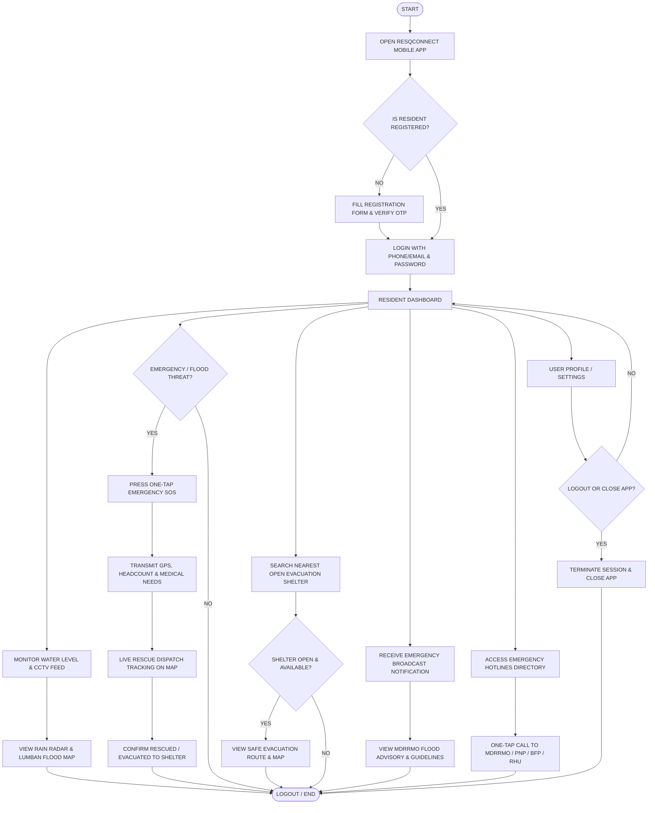
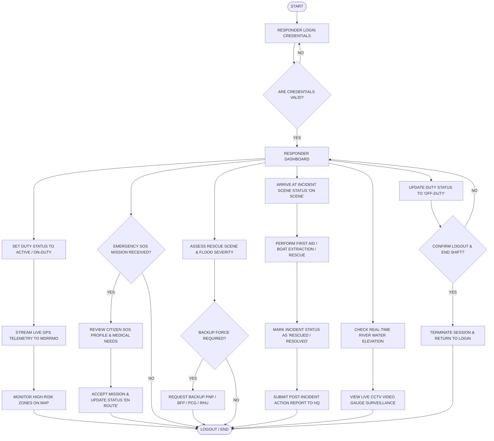
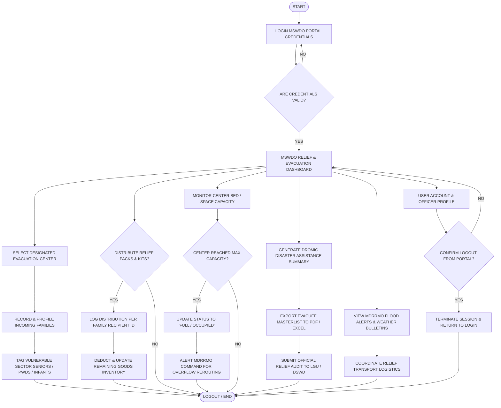

# COMPLETE PROCESS FLOWCHARTS MASTER GUIDE & TUTORIAL
### Flood Monitoring & Disaster Response Management System
*(ResQConnect Mobile App & MDRRMO/MSWDO Web Portals)*

---

## 📌 Overview of Generated Flowcharts

All flowcharts for the system's four primary actor roles have been generated in the **academic multi-column right-angle format** matching your reference thesis manuscript (`CS04-Arriola-Robles-manuscript.pdf`, Page 135).

Each diagram features:
- **Top spine:** `START` $\rightarrow$ `LOGIN` $\rightarrow$ `DASHBOARD`.
- **Right-angle distribution bus** cleanly branching into parallel functional columns.
- **Zero diagonal line crossings** (clean orthogonal 90-degree lines).
- **Bottom collection bus** converging into `LOGOUT / END`.
- **Publication-ready academic styling** (clean black border on white background).

---

## 📁 Ready-to-Open `.drawio` Files in Your Project

| Role | Target Platform | File Link | Manuscript Figure |
| :--- | :--- | :--- | :--- |
| **MDRRMO Administrator** | Web Command Center | [`ADMIN_ROLE_FLOWCHART.drawio`](file:///c:/Users/jayze/Documents/GitHub/Flood_Monitoring/ADMIN_ROLE_FLOWCHART.drawio) | **Figure 39** |
| **Community Resident / Citizen** | ResQConnect Mobile App | [`RESIDENT_ROLE_FLOWCHART.drawio`](file:///c:/Users/jayze/Documents/GitHub/Flood_Monitoring/RESIDENT_ROLE_FLOWCHART.drawio) | **Figure 40** |
| **Emergency Responder / Rescue Team** | ResQConnect Mobile App (Field Mode) | [`RESPONDER_ROLE_FLOWCHART.drawio`](file:///c:/Users/jayze/Documents/GitHub/Flood_Monitoring/RESPONDER_ROLE_FLOWCHART.drawio) | **Figure 41** |
| **MSWDO Officer / Camp Manager** | MSWDO Web Portal | [`MSWDO_ROLE_FLOWCHART.drawio`](file:///c:/Users/jayze/Documents/GitHub/Flood_Monitoring/MSWDO_ROLE_FLOWCHART.drawio) | **Figure 42** |

---

## 🚀 How to Load Any Diagram in Draw.io

### Method A: Open From Device
1. In your **draw.io** browser tab, click **`File`** $\rightarrow$ **`Open From`** $\rightarrow$ **`Device...`**.
2. Select any `.drawio` file from your `Flood_Monitoring` directory.

### Method B: Copy-Paste XML (Fastest)
1. In your **draw.io** tab, click **`Extras`** in the top menu $\rightarrow$ **`Edit Diagram...`**.
2. Press **`Ctrl + A`** to select all, then replace with the XML provided in each section below.
3. Click **`OK`**.

---

# 1. Community Resident / Citizen (ResQConnect Mobile)

### Figure Title for Manuscript:
> **Figure 40. Proposed Process Flowchart – Community Resident / Citizen (ResQConnect Mobile Application)**

### Manuscript Narrative (Copy to Chapter 3 / 4):
> Figure 40 presents the operational process flowchart for community residents utilizing the ResQConnect mobile application. Upon launching the application, unregistered users are routed to complete verification via SMS one-time passwords (OTP) before accessing the login interface. Authenticated citizens are directed to the Resident Dashboard, which branches into five vital disaster mitigation capabilities: real-time hydrological water level observation and CCTV video streaming, immediate one-tap emergency SOS broadcasting with GPS telemetry and household demographic tagging, geolocation-based evacuation center route discovery, receipt of municipal weather and flood advisories, and direct single-touch speed dialing to local emergency hotlines (MDRRMO, PNP, BFP, RHU). Upon completion or session termination, the application executes a secure exit procedure converging to the terminal state.

### Mermaid Diagram Code:

---

# 2. Emergency Responder / Rescue Team (ResQConnect Mobile)

### Figure Title for Manuscript:
> **Figure 41. Proposed Process Flowchart – Emergency Responder / Rescue Team (ResQConnect Field Application)**

### Manuscript Narrative (Copy to Chapter 3 / 4):
> Figure 41 depicts the operational workflow for emergency rescue personnel operating in the field. Authorized responders log in with role-verified credentials and access the specialized Responder Dashboard. Active units immediately stream live GPS location telemetry to the central MDRRMO Command Center. When distress calls are dispatched, responders review the victim's location, household headcount, and special medical conditions prior to accepting the assignment and transitioning duty status to 'En Route'. On-site, responders assess flood severity, request inter-agency backup (PNP, BFP, Philippine Coast Guard, or Rural Health Unit) if required, conduct boat extraction or first-aid triage, and mark missions as 'Rescued / Resolved' before submitting post-incident action reports.

### Mermaid Diagram Code:

---

# 3. MSWDO Officer / Evacuation Camp Manager (Web Portal)

### Figure Title for Manuscript:
> **Figure 42. Proposed Process Flowchart – MSWDO Officer / Evacuation Camp Manager (Web Application)**

### Manuscript Narrative (Copy to Chapter 3 / 4):
> Figure 42 details the administrative and humanitarian relief management processes executed by the Municipal Social Welfare and Development Office (MSWDO). Following privileged credential authentication, the officer accesses the MSWDO Relief and Evacuation Dashboard. The workflow coordinates four mission-critical camp management responsibilities: family profiling and demographic intake tagging vulnerable sectors (seniors, PWDs, infants, and pregnant mothers); real-time logging of family food pack (FFP) and hygiene kit distributions with automatic inventory balance deduction; dynamic tracking of evacuation shelter bed capacity with automated overflow notifications sent to MDRRMO to redirect evacuees; and automated generation and export of official DROMIC (Disaster Response Operations Monitoring and Information Center) masterlist audit reports.

### Mermaid Diagram Code:

