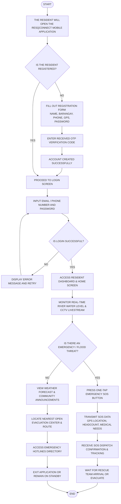
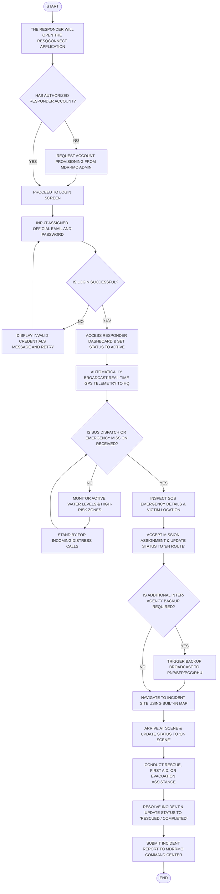
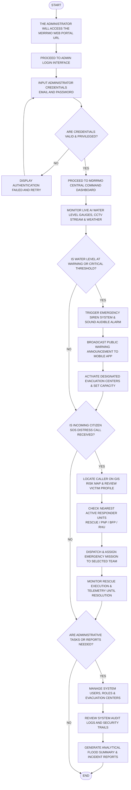
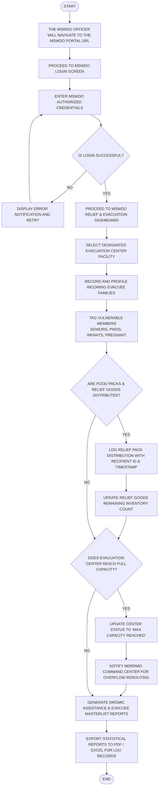

# SYSTEM PROCESS FLOWCHARTS GUIDE
### Flood Monitoring & Disaster Response Management System
*(ResQConnect Mobile Application & MDRRMO/MSWDO Web Portals)*

---

## 📖 Overview & Manuscript Standards

This guide provides the exact specifications, shapes, text, and connections needed to draw process flowcharts for your manuscript/thesis (matching the format shown in your reference images).

### Standard Flowchart Symbols Used:
| Symbol / Shape | Name | Purpose in Diagram |
| :---: | :---: | :--- |
| **Oval / Capsule** | **Terminator** | Represents `START` or `END` of the entire process. |
| **Rectangle** | **Process** | Represents an action, system step, input, or screen navigation. |
| **Diamond** | **Decision** | Represents a conditional check requiring a `YES` or `NO` branch. |
| **Circle** | **Connector** | Used with a letter (e.g., `A` or `C`) when splitting flow across pages. |
| **Arrow (Line)** | **Flowline** | Shows the sequence and direction of operations. |

---

## Table of Flowcharts
1. [Flowchart 1: Community Resident / Citizen (Mobile App)](#flowchart-1-community-resident--citizen-resqconnect-mobile)
2. [Flowchart 2: Emergency Responder / Rescue Team (Mobile App)](#flowchart-2-emergency-responder--rescue-team-mobile)
3. [Flowchart 3: MDRRMO Administrator / Command Center (Web Portal)](#flowchart-3-mdrrmo-administrator--command-center-web)
4. [Flowchart 4: MSWDO Officer / Evacuation Manager (Web Portal)](#flowchart-4-mswdo-officer--evacuation-manager-web)

---

# Flowchart 1: Community Resident / Citizen (ResQConnect Mobile)

### Figure Title for Manuscript:
> **PROPOSED PROCESS FLOWCHART – COMMUNITY RESIDENT / CITIZEN**

### Step-by-Step Shape & Content Table:

| Step # | Shape | Text to Write Inside Shape | Connects To (Next Step) | Arrow Label / Condition |
| :---: | :---: | :--- | :---: | :---: |
| **1** | **Oval** | `START` | Step 2 | — |
| **2** | **Rectangle** | `THE RESIDENT WILL OPEN THE RESQCONNECT MOBILE APPLICATION` | Step 3 | — |
| **3** | **Diamond** | `IS THE RESIDENT REGISTERED?` | Step 4 (NO) Step 7 (YES) | `NO` `YES` |
| **4** | **Rectangle** | `FILL OUT REGISTRATION FORM (NAME, BARANGAY, PHONE, GPS, PASSWORD)` | Step 5 | — |
| **5** | **Rectangle** | `ENTER RECEIVED OTP VERIFICATION CODE` | Step 6 | — |
| **6** | **Rectangle** | `ACCOUNT CREATED SUCCESSFULLY` | Step 7 | — |
| **7** | **Rectangle** | `PROCEED TO LOGIN SCREEN` | Step 8 | — |
| **8** | **Rectangle** | `INPUT EMAIL / PHONE NUMBER AND PASSWORD` | Step 9 | — |
| **9** | **Diamond** | `IS LOGIN SUCCESSFUL?` | Step 10 (NO) Step 11 (YES) | `NO` `YES` |
| **10** | **Rectangle** | `DISPLAY ERROR MESSAGE (INVALID CREDENTIALS) AND RETRY` | Step 8 (Loop back) | — |
| **11** | **Rectangle** | `ACCESS RESIDENT DASHBOARD & HOME SCREEN` | Step 12 | — |
| **12** | **Rectangle** | `MONITOR REAL-TIME RIVER WATER LEVEL & CCTV LIVESTREAM` | Step 13 | — |
| **13** | **Diamond** | `IS THERE AN EMERGENCY / FLOOD THREAT?` | Step 14 (NO) Step 17 (YES) | `NO` `YES` |
| **14** | **Rectangle** | `VIEW WEATHER FORECAST & COMMUNITY FLOOD ANNOUNCEMENTS` | Step 15 | — |
| **15** | **Rectangle** | `LOCATE NEAREST OPEN EVACUATION CENTER & VIEW ROUTE` | Step 16 | — |
| **16** | **Rectangle** | `ACCESS EMERGENCY HOTLINES DIRECTORY (MDRRMO, PNP, BFP, RHU)` | Step 21 | — |
| **17** | **Rectangle** | `PRESS ONE-TAP EMERGENCY SOS BUTTON` | Step 18 | — |
| **18** | **Rectangle** | `TRANSMIT SOS DATA (GPS LOCATION, HOUSEHOLD HEADCOUNT, MEDICAL NEEDS)` | Step 19 | — |
| **19** | **Rectangle** | `RECEIVE SOS DISPATCH CONFIRMATION & LIVE RESCUE TRACKING` | Step 20 | — |
| **20** | **Rectangle** | `WAIT FOR RESCUE TEAM ARRIVAL OR PROCEED TO EVACUATION SHELTER` | Step 22 | — |
| **21** | **Rectangle** | `EXIT APPLICATION OR REMAIN ON STANDBY` | Step 22 | — |
| **22** | **Oval** | `END` | — | — |

---

### Visual Preview (Mermaid Diagram):

---

# Flowchart 2: Emergency Responder / Rescue Team (Mobile)
*(Applicable to: RESCUE, PNP, BFP, RHU, COAST GUARD, MDRRMO RESPONDER, BARANGAY OFFICIAL)*

### Figure Title for Manuscript:
> **PROPOSED PROCESS FLOWCHART – EMERGENCY RESPONDER / RESCUE TEAM**

### Step-by-Step Shape & Content Table:

| Step # | Shape | Text to Write Inside Shape | Connects To (Next Step) | Arrow Label / Condition |
| :---: | :---: | :--- | :---: | :---: |
| **1** | **Oval** | `START` | Step 2 | — |
| **2** | **Rectangle** | `THE RESPONDER WILL OPEN THE RESQCONNECT APPLICATION` | Step 3 | — |
| **3** | **Diamond** | `HAS AUTHORIZED RESPONDER ACCOUNT?` | Step 4 (NO) Step 5 (YES) | `NO` `YES` |
| **4** | **Rectangle** | `REQUEST ACCOUNT PROVISIONING FROM MDRRMO ADMINISTRATOR` | Step 5 (Wait/Get login) | — |
| **5** | **Rectangle** | `PROCEED TO LOGIN SCREEN` | Step 6 | — |
| **6** | **Rectangle** | `INPUT ASSIGNED OFFICIAL EMAIL AND PASSWORD` | Step 7 | — |
| **7** | **Diamond** | `IS LOGIN SUCCESSFUL?` | Step 8 (NO) Step 9 (YES) | `NO` `YES` |
| **8** | **Rectangle** | `DISPLAY INVALID CREDENTIALS MESSAGE AND RETRY` | Step 6 (Loop back) | — |
| **9** | **Rectangle** | `ACCESS RESPONDER DASHBOARD & SET DUTY STATUS TO ACTIVE` | Step 10 | — |
| **10** | **Rectangle** | `AUTOMATICALLY BROADCAST REAL-TIME GPS TELEMETRY TO HQ` | Step 11 | — |
| **11** | **Diamond** | `IS SOS DISPATCH OR EMERGENCY MISSION RECEIVED?` | Step 12 (NO) Step 14 (YES) | `NO` `YES` |
| **12** | **Rectangle** | `MONITOR ACTIVE WATER LEVELS & HIGH-RISK FLOOD SECTORS` | Step 13 | — |
| **13** | **Rectangle** | `STAND BY FOR INCOMING DISTRESS CALLS OR BACKUP REQUESTS` | Step 11 (Loop back) | — |
| **14** | **Rectangle** | `INSPECT SOS EMERGENCY DETAILS, VICTIM LOCATION & HAZARDS` | Step 15 | — |
| **15** | **Rectangle** | `ACCEPT MISSION ASSIGNMENT & UPDATE STATUS TO "EN ROUTE"` | Step 16 | — |
| **16** | **Diamond** | `IS ADDITIONAL INTER-AGENCY BACKUP REQUIRED?` | Step 17 (YES) Step 18 (NO) | `YES` `NO` |
| **17** | **Rectangle** | `TRIGGER INTER-AGENCY BACKUP BROADCAST (BFP, PNP, PCG, RHU)` | Step 18 | — |
| **18** | **Rectangle** | `NAVIGATE TO INCIDENT SITE USING BUILT-IN MAP DIRECTIONS` | Step 19 | — |
| **19** | **Rectangle** | `ARRIVE AT SCENE & UPDATE STATUS TO "ON SCENE"` | Step 20 | — |
| **20** | **Rectangle** | `CONDUCT RESCUE, FIRST AID, OR EVACUATION ASSISTANCE` | Step 21 | — |
| **21** | **Rectangle** | `RESOLVE INCIDENT & UPDATE STATUS TO "RESCUED / COMPLETED"` | Step 22 | — |
| **22** | **Rectangle** | `SUBMIT INCIDENT REPORT TO MDRRMO COMMAND CENTER` | Step 23 | — |
| **23** | **Oval** | `END` | — | — |

---

### Visual Preview (Mermaid Diagram):

---

# Flowchart 3: MDRRMO Administrator / Command Center (Web)
*(Applicable to: MDRRMO ADMIN, SUPER ADMIN)*

### Figure Title for Manuscript:
> **PROPOSED PROCESS FLOWCHART – MDRRMO ADMINISTRATOR**

### Step-by-Step Shape & Content Table:

| Step # | Shape | Text to Write Inside Shape | Connects To (Next Step) | Arrow Label / Condition |
| :---: | :---: | :--- | :---: | :---: |
| **1** | **Oval** | `START` | Step 2 | — |
| **2** | **Rectangle** | `THE ADMINISTRATOR WILL ACCESS THE MDRRMO WEB PORTAL URL` | Step 3 | — |
| **3** | **Rectangle** | `PROCEED TO ADMIN LOGIN INTERFACE` | Step 4 | — |
| **4** | **Rectangle** | `INPUT ADMINISTRATOR CREDENTIALS (EMAIL AND PASSWORD)` | Step 5 | — |
| **5** | **Diamond** | `ARE CREDENTIALS VALID & PRIVILEGED?` | Step 6 (NO) Step 7 (YES) | `NO` `YES` |
| **6** | **Rectangle** | `DISPLAY ACCESS DENIED / AUTHENTICATION FAILED MESSAGE` | Step 4 (Loop back) | — |
| **7** | **Rectangle** | `PROCEED TO MDRRMO CENTRAL INCIDENT COMMAND DASHBOARD` | Step 8 | — |
| **8** | **Rectangle** | `MONITOR LIVE AI WATER LEVEL GAUGES, CCTV STREAM & WEATHER` | Step 9 | — |
| **9** | **Diamond** | `IS WATER LEVEL AT WARNING OR CRITICAL THRESHOLD?` | Step 10 (YES) Step 13 (NO) | `YES` `NO` |
| **10** | **Rectangle** | `TRIGGER EMERGENCY SIREN SYSTEM & SOUND AUDIBLE ALARM` | Step 11 | — |
| **11** | **Rectangle** | `BROADCAST PUBLIC WARNING ANNOUNCEMENT TO MOBILE APP USERS` | Step 12 | — |
| **12** | **Rectangle** | `ACTIVATE DESIGNATED EVACUATION CENTERS & SET CAPACITY` | Step 13 | — |
| **13** | **Diamond** | `IS INCOMING CITIZEN SOS DISTRESS CALL RECEIVED?` | Step 14 (YES) Step 18 (NO) | `YES` `NO` |
| **14** | **Rectangle** | `LOCATE CALLER ON GIS RISK MAP & REVIEW VICTIM PROFILE` | Step 15 | — |
| **15** | **Rectangle** | `CHECK NEAREST ACTIVE RESPONDER UNITS (RESCUE/PNP/BFP/RHU)` | Step 16 | — |
| **16** | **Rectangle** | `DISPATCH & ASSIGN EMERGENCY MISSION TO SELECTED TEAM` | Step 17 | — |
| **17** | **Rectangle** | `MONITOR RESCUE EXECUTION & GPS TELEMETRY UNTIL RESOLUTION` | Step 18 | — |
| **18** | **Diamond** | `ARE ADMINISTRATIVE TASKS OR SYSTEM REPORTS NEEDED?` | Step 19 (YES) Step 22 (NO) | `YES` `NO` |
| **19** | **Rectangle** | `MANAGE SYSTEM USERS, ROLES, BARANGAYS & EVACUATION CENTERS` | Step 20 | — |
| **20** | **Rectangle** | `REVIEW SYSTEM AUDIT LOGS AND SECURITY TRAILS` | Step 21 | — |
| **21** | **Rectangle** | `GENERATE ANALYTICAL FLOOD SUMMARY & DISASTER INCIDENT REPORTS` | Step 22 | — |
| **22** | **Oval** | `END` | — | — |

---

### Visual Preview (Mermaid Diagram):

---

# Flowchart 4: MSWDO Officer / Evacuation Manager (Web)
*(Applicable to: MSWDO STAFF & ADMIN)*

### Figure Title for Manuscript:
> **PROPOSED PROCESS FLOWCHART – MSWDO OFFICER / EVACUATION MANAGER**

### Step-by-Step Shape & Content Table:

| Step # | Shape | Text to Write Inside Shape | Connects To (Next Step) | Arrow Label / Condition |
| :---: | :---: | :--- | :---: | :---: |
| **1** | **Oval** | `START` | Step 2 | — |
| **2** | **Rectangle** | `THE MSWDO OFFICER WILL NAVIGATE TO THE MSWDO PORTAL URL` | Step 3 | — |
| **3** | **Rectangle** | `PROCEED TO MSWDO LOGIN SCREEN` | Step 4 | — |
| **4** | **Rectangle** | `ENTER MSWDO AUTHORIZED CREDENTIALS` | Step 5 | — |
| **5** | **Diamond** | `IS LOGIN SUCCESSFUL?` | Step 6 (NO) Step 7 (YES) | `NO` `YES` |
| **6** | **Rectangle** | `DISPLAY ERROR NOTIFICATION AND RETRY` | Step 4 (Loop back) | — |
| **7** | **Rectangle** | `PROCEED TO MSWDO RELIEF & EVACUATION DASHBOARD` | Step 8 | — |
| **8** | **Rectangle** | `SELECT DESIGNATED EVACUATION CENTER FACILITY` | Step 9 | — |
| **9** | **Rectangle** | `RECORD AND PROFILE INCOMING EVACUEE FAMILIES` | Step 10 | — |
| **10** | **Rectangle** | `IDENTIFY & TAG VULNERABLE MEMBERS (SENIORS, PWDS, INFANTS, PREGNANT)` | Step 11 | — |
| **11** | **Diamond** | `ARE FOOD PACKS & RELIEF GOODS DISTRIBUTED?` | Step 12 (YES) Step 14 (NO) | `YES` `NO` |
| **12** | **Rectangle** | `LOG RELIEF PACK DISTRIBUTION WITH RECIPIENT ID & TIMESTAMP` | Step 13 | — |
| **13** | **Rectangle** | `UPDATE RELIEF GOODS REMAINING INVENTORY COUNT` | Step 14 | — |
| **14** | **Diamond** | `DOES EVACUATION CENTER REACH FULL CAPACITY?` | Step 15 (YES) Step 17 (NO) | `YES` `NO` |
| **15** | **Rectangle** | `UPDATE CENTER STATUS TO "MAX CAPACITY REACHED"` | Step 16 | — |
| **16** | **Rectangle** | `NOTIFY MDRRMO COMMAND CENTER FOR OVERFLOW REROUTING` | Step 17 | — |
| **17** | **Rectangle** | `GENERATE DROMIC DISASTER ASSISTANCE & EVACUEE MASTERLIST REPORTS` | Step 18 | — |
| **18** | **Rectangle** | `EXPORT STATISTICAL REPORTS TO PDF / EXCEL FOR LGU RECORDS` | Step 19 | — |
| **19** | **Oval** | `END` | — | — |

---

### Visual Preview (Mermaid Diagram):

---

## 🎨 How to Draw These Cleanly in Microsoft Word or Draw.io

When creating your diagrams for the thesis manuscript:

1. **Software Recommendation**:
   - **draw.io (diagrams.net)** *(Free, very easy, clean export to High-Res PNG or PDF)*
   - **Microsoft Word / Visio** *(Insert -> Shapes)*
   - **Canva** *(Search "Flowchart template")*

2. **Styling Rules to Match Academic Manuscripts**:
   - **Palette**: Black outlines (`#000000`) with white fill (`#FFFFFF`) or subtle grayscale accents.
   - **Font**: Use **Times New Roman** or **Arial**, size `9pt` to `10pt`, Bold for titles, Regular for descriptions.
   - **Capitalization**: All-caps (`ALL CAPS`) or title case, matching your manuscript style.
   - **Flow Direction**: Top-to-bottom vertical orientation.
   - **Branching**: For diamond decisions:
     - Output `YES` should point **downwards** or **right**.
     - Output `NO` should point **sideways** or loop back to the retry point.
     - Always label arrow lines with clean `YES` and `NO` text.
   - **Multi-Page Splitting**: If a diagram doesn't fit on one page:
     - Place a small circle with letter `A` or `C` at the bottom of the first page.
     - Start the next page with the same circle `A` or `C`, then continue the flow.
