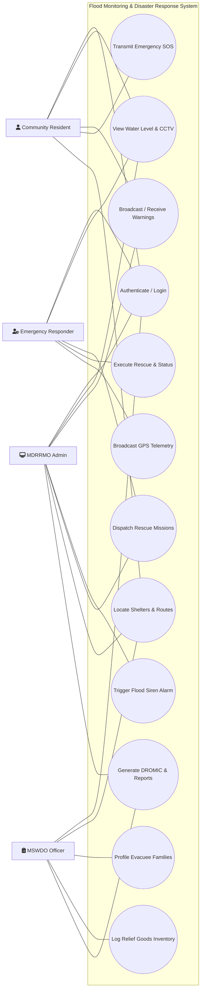
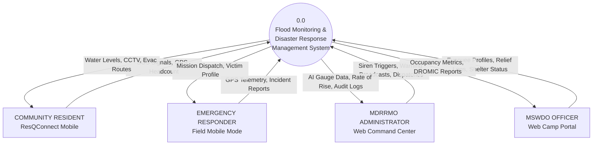

# 4-USER SYSTEM DIAGRAMS & MANUSCRIPT GUIDE
### Flood Monitoring & Disaster Response Management System
*(ResQConnect Mobile App & MDRRMO/MSWDO Web Portals)*

---

## 📌 Overview

In Chapter 3 (Methodology) of IT/Computer Science thesis manuscripts, systems with multiple distinct users are primarily modeled using two standard architectural diagrams:

1. **UML System Use Case Diagram (Recommended ⭐):** 
   Illustrates the 4 external human actors interacting with the core functionalities (use cases) encased within the system boundary.
2. **Context Diagram (Data Flow Diagram / DFD Level 0):** 
   Depicts the system as a central process (`0.0`) surrounded by the 4 external entities, detailing the precise data inflows and outflows exchanged with each user role.

---

## 👥 The 4 User Roles in Your System

| # | User Actor Role | Platform | Primary Responsibilities |
| :---: | :--- | :--- | :--- |
| **1** | **Community Resident / Citizen** | Mobile App (`ResQConnect`) | Monitors river water levels & CCTV; triggers one-tap emergency SOS with GPS & headcount; views safe evacuation routes; receives LGU flood advisories. |
| **2** | **Emergency Responder / Rescue Team** | Mobile App (Field Mode) | Broadcasts live GPS telemetry; receives & accepts SOS missions; assesses flood severity; requests inter-agency backup (PNP/BFP/RHU); reports incident resolution. |
| **3** | **MDRRMO Administrator** | Web Command Center | Monitors real-time AI gauge readings & CCTV; triggers audible siren alarm; dispatches rescue units on GIS map; manages user accounts and analytical reports. |
| **4** | **MSWDO Officer / Evacuation Manager** | MSWDO Web Portal | Selects designated shelter; profiles evacuee families & tags vulnerable sectors; logs relief distribution; monitors capacity & alerts MDRRMO for overflow. |

---

## 💻 Where & How to Create These Diagrams

You can open and edit both diagrams directly in **draw.io** (`app.diagrams.net`), which is already open in your browser tab!

### Option 1: Open the Files Directly from Your Computer
The files are saved in your project folder:
* **Use Case Diagram:** [`SYSTEM_USE_CASE_DIAGRAM.drawio`](file:///c:/Users/jayze/Documents/GitHub/Flood_Monitoring/SYSTEM_USE_CASE_DIAGRAM.drawio)
* **Context Diagram (DFD Level 0):** [`CONTEXT_DIAGRAM_DFD_LEVEL_0.drawio`](file:///c:/Users/jayze/Documents/GitHub/Flood_Monitoring/CONTEXT_DIAGRAM_DFD_LEVEL_0.drawio)

*In draw.io:* Click **`File`** $\rightarrow$ **`Open From`** $\rightarrow$ **`Device...`** $\rightarrow$ select either `.drawio` file.

### Option 2: Add as New Pages in Your Current Draw.io File
1. In your open **draw.io** browser tab, look at the bottom left where it says **`Page-1`** and click the **`+` (Add Page)** button.
2. Name the new page (e.g., `Use Case Diagram` or `Context Diagram`).
3. Click **`Extras`** in the top menu bar $\rightarrow$ select **`Edit Diagram...`**.
4. Press **`Ctrl + A`** to select all, replace it with the XML code below, and click **`OK`**!

---

## 1. UML System Use Case Diagram (4 Actors)

### Figure Title for Manuscript:
> **Figure 35. System Use Case Diagram of the Flood Monitoring and Disaster Response Management System**

### Manuscript Narrative (Copy to Chapter 3):
> Figure 35 presents the Unified Modeling Language (UML) Use Case Diagram defining the functional boundaries and behavioral interactions of the four system actors: the Community Resident, the Emergency Responder, the MDRRMO Administrator, and the MSWDO Officer. 
> 
> All four actors authenticate through a centralized credential verification module. The Community Resident interacts primarily with the ResQConnect mobile application to view real-time hydrological water levels, transmit emergency SOS distress beacons with embedded GPS coordinates and household vulnerability indicators, and identify designated evacuation shelters. The Emergency Responder utilizes the mobile field interface to stream live telemetry, accept assigned rescue missions, request multi-agency backup forces, and log on-scene victim extractions. 
> 
> Centrally, the MDRRMO Administrator exercises operational command via the web portal, monitoring OpenCV-analyzed CCTV video feeds, activating municipal flood siren alarms, coordinating rescue dispatch missions, and generating incident summary audits. Concurrently, the MSWDO Officer administers evacuation camp logistics by profiling incoming evacuee families, tagging vulnerable individuals (seniors, PWDs, infants, and pregnant mothers), tracking relief goods inventory distributions, and compiling official DROMIC disaster assistance reports.

### Mermaid Diagram Representation:

---

## 2. Context Diagram (DFD Level 0)

### Figure Title for Manuscript:
> **Figure 36. Context Diagram (Data Flow Diagram Level 0) of the System**

### Manuscript Narrative (Copy to Chapter 3):
> Figure 36 presents the Context Diagram (DFD Level 0) establishing the overarching data communication boundaries between Process 0.0 (*Flood Monitoring and Disaster Response Management System*) and its four external human entities. 
> 
> The Community Resident supplies household registration details, GPS distress coordinates, and medical triage flags, receiving in return calibrated river water elevations, live video streams, emergency siren advisories, and safe evacuation waypoints. The Emergency Responder inputs live GPS location telemetry, mission status transitions (En Route, On Scene, Rescued), and on-scene action reports, receiving automated dispatch notifications and victim coordinates. 
> 
> The MDRRMO Administrator provides operational overrides, siren alarm triggers, broadcast warnings, and dispatch orders, while extracting real-time computer vision gauge telemetry, rate-of-rise metrics, spatial responder tracking, and audit trails. Lastly, the MSWDO Officer transmits evacuee demographic intakes, vulnerability tags, relief goods distribution logs, and shelter capacity updates, while extracting real-time shelter occupancy summaries, evacuee masterlists, and exportable DROMIC compliance reports.

### Mermaid Diagram Representation:

